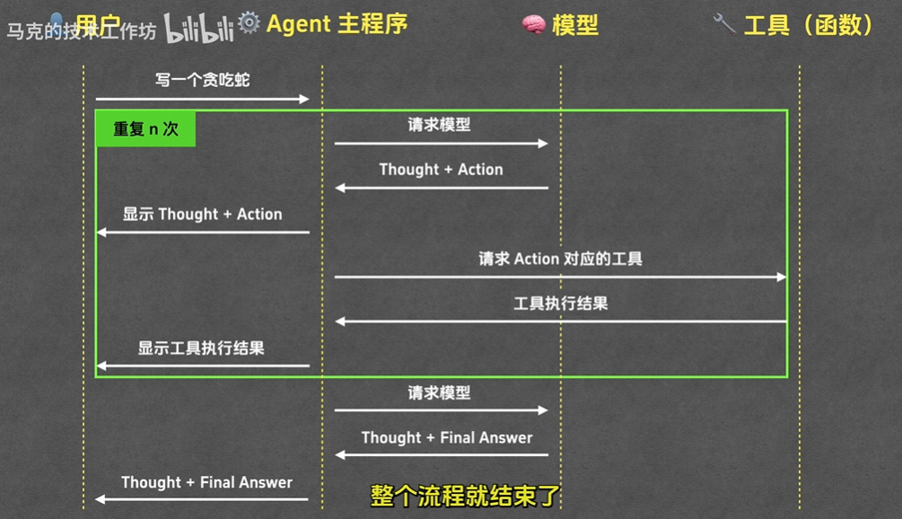
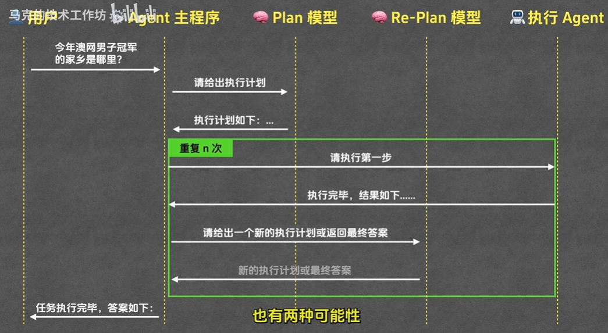

# AI Learning 学习笔记

> 记录日期：2026-04-24。问题编号来自当日对话记录，可能不连续；内容已按主题尽量整理。

## 快速索引
- 仓库结构与文件类型：问题 1
- ReAct Agent 最小实现项目解读：问题 2
- `uv run` / 环境与启动：问题 3、问题 4、问题 7
- PowerShell 激活脚本与执行策略：问题 6
- 读懂 `agent.py` 的方法：问题 9、问题 10
- 厂商/术语/选型要点：问题 11
- Agent 构建模式对比（ReAct vs Plan-and-Execute）：文末「Agent 构建模式」

## 2026-04-24

### 问题 1
`E:\TsingProject\AILearning-VideoCode` 文件夹中有哪些内容？

### 记录
该仓库是“马克的技术工作坊”示例代码集合，按视频主题拆分为多个子目录，核心包括：

1. A2A 协议相关示例
- `A2A协议深度解析(1)\weather`
- `A2A协议深度解析(2)\weather`
- `A2A协议深度解析(2)\flight`
- 特点：基于 `a2a-sdk`、`uvicorn`，含示例请求/返回 JSON

2. Agent 基础与构建
- `Agent的概念、原理与构建模式`
- 特点：使用 `openai`、`click`、`python-dotenv` 进行 Agent 演示

3. MCP 与 Function Calling 对比
- `MCP 与 Function Calling 到底什么关系\MarkChat`
- 特点：`flask` + `mcp` + 前端页面（`templates`/`static`）

4. MCP 扩展内容
- `MCP终极指南-番外篇`：系统提示词与日志示例
- `MCP终极指南-进阶篇\weather`：天气 MCP Server + I/O 记录

5. RAG 示例
- `使用Python构建RAG系统\rag`
- 特点：`chromadb`、`sentence-transformers`、`google-genai`，含 `main.ipynb`

### 当前仓库文件类型概览
- `.py` 15 个
- `.md` 13 个
- `.toml` 7 个
- `.json` 6 个
- 另有 `.ipynb`、`.html/.css/.js`、`.lock`、`.log` 等

### 问题 2
`E:\TsingProject\AILearning-VideoCode\Agent的概念、原理与构建模式` 内有什么内容？它描述了什么？

### 记录
这是一个教学型的 **ReAct Agent 最小实现项目**，重点在于展示 Agent 的完整执行闭环：  
`用户问题 -> 模型思考(thought) -> 工具调用(action) -> 工具反馈(observation) -> 最终答案(final_answer)`。

核心文件与作用：

1. `agent.py`
- 定义 `ReActAgent` 主流程（循环调用模型、解析 XML 标签、执行工具、回填 observation）。
- 内置 3 个基础工具：`read_file`、`write_to_file`、`run_terminal_command`。
- 对终端命令增加人工确认（Y/N），用于演示“高风险动作的人类把关”。
- 使用 `OpenRouter` 兼容接口调用模型（默认 `openai/gpt-4o`）。

2. `prompt_template.py`
- 定义 ReAct 系统提示词模板。
- 强制模型按 XML 标签输出：`<thought>`、`<action>`、`<observation>`、`<final_answer>`。
- 约束关键行为：每轮先思考再行动、输出 action 后停止等待真实 observation、路径用绝对路径等。

3. `README.md`
- 说明运行方式：配置 `.env`（`OPENROUTER_API_KEY`）后执行 `uv run agent.py snake`。

4. `pyproject.toml`
- 依赖聚焦在教学必需最小集：`openai`、`click`、`python-dotenv`。

教学重点总结：
- 解释 Agent 不只是“一次性问答”，而是“多步推理 + 工具交互”的循环系统。
- 展示 Prompt 如何约束模型行为格式，使程序可解析、可控制。
- 展示工具机制如何赋予模型“读文件、写文件、执行命令”的外部能力。

### 问题 3
为什么执行 `uv run agent.py snake` 失败？是不是因为没有配置虚拟环境？

### 记录
不是虚拟环境问题，核心报错是：系统找不到 `uv` 命令（`uv is not recognized`）。

关键结论：
- `uv run` 不要求手动先创建 venv，`uv` 会自动处理环境与依赖。
- 当前机器需要先安装 `uv`，并重开终端后再运行。

### 问题 4
`uv run` 是干什么用的？

### 记录
`uv run <命令>` 的作用是：在项目隔离环境中执行命令，并自动完成环境准备。

通常包含三件事：
1. 创建/复用项目虚拟环境。
2. 根据 `pyproject.toml` / `uv.lock` 安装依赖。
3. 在该环境中运行目标命令（如 `agent.py snake`）。

### 问题 6
PowerShell 命令 `(Set-ExecutionPolicy ...); (& ...Activate.ps1)` 是什么意思？

### 记录
这是一条“激活虚拟环境前置命令”，含两段：
1. `Set-ExecutionPolicy -Scope Process -ExecutionPolicy RemoteSigned`  
仅在当前终端临时放宽脚本执行策略。
2. `(& ...\\Scripts\\Activate.ps1)`  
执行指定路径虚拟环境的激活脚本。

注意事项：
- 如果路径指向别的项目（如 `verilogAi\\.venv`），激活的就不是当前项目环境。

### 问题 7
当前应如何正确启动这个 Agent 项目？

### 记录
推荐顺序：
1. 进入目录：`E:\\TsingProject\\AILearning-VideoCode\\Agent的概念、原理与构建模式`
2. 安装并确认 `uv` 可用（`uv --version`）。
3. 配置 `.env`（按你使用的平台二选一：OpenRouter 用 `OPENROUTER_API_KEY` + 模型名；Ark 用 `ARK_API_KEY` + `ARK_MODEL=ep-...`，可加 `ARK_BASE_URL`）。
4. 运行：`uv run agent.py snake`


### 问题 9
我不懂 Python 语法，如何看懂 `agent.py` 的内核？

### 记录
下面用“语法点 + 本项目实例”的方式讲解。建议你一边看本笔记，一边打开 `agent.py` 对照行号阅读。

#### 1) `import`：导入模块（相当于“引入工具箱”）
- 例子：`import os`、`import re`、`from openai import OpenAI`
- 含义：后面可以使用这些模块里的功能。
- 本项目中：
  - `os` 用于路径/环境变量；
  - `re` 用于正则匹配 `<thought>/<action>` 标签；
  - `OpenAI` 用于调用模型接口。

#### 2) `class`：定义类（把数据和行为放在一起）
- 例子：`class ReActAgent:`
- 含义：`ReActAgent` 是一个“Agent 模板”，可以创建对象来运行。

#### 3) `def`：定义函数/方法
- 例子：`def run(self, user_input: str):`
- 含义：
  - `def` 后面是函数名；
  - 括号里是参数；
  - 冒号后面缩进的代码属于这个函数。
- 其中 `self` 代表“当前对象本身”。

#### 4) 构造函数 `__init__`
- 例子：`def __init__(self, tools, model, project_directory):`
- 含义：创建对象时自动执行，用来初始化成员变量。
- 本项目里初始化了：
  - `self.tools`：可调用工具集合；
  - `self.model`：模型名/endpoint；
  - `self.client`：LLM 客户端。

#### 5) 字典和列表
- 字典：`{key: value}`，按键取值。
- 列表：`[a, b, c]`，按顺序存储。
- 本项目实例：
  - `self.tools = { func.__name__: func for func in tools }`  
    这是“字典推导式”，把工具函数列表转成 `工具名 -> 函数对象`。
  - `messages = [...]`  
    用列表保存多轮对话消息。

#### 6) 循环与分支
- `while True:` 表示无限循环，直到 `return` 跳出。
- `if / elif / else` 做条件判断。
- 本项目内核：
  1. 调模型拿输出；
  2. 如果有 `<final_answer>` 就结束；
  3. 否则解析 `<action>` 并执行工具；
  4. 把工具结果作为 `<observation>` 再喂回模型。

#### 7) 字符串和 f-string
- 例子：`f"<question>{user_input}</question>"`
- 含义：`{}` 里可放变量，运行时自动替换。

#### 8) 异常处理 `try/except`
- 例子：
  - 调工具时：失败不会让程序直接崩，而是把错误文本当 observation 回传。
  - 调模型时：针对 Ark 常见报错给出更清晰提示。
- 含义：让程序更“抗故障”。

#### 9) 静态方法 `@staticmethod`
- 例子：`@staticmethod def get_llm_config()`
- 含义：这个方法不依赖对象实例字段，可直接挂在类上作为“工具函数”使用。

#### 10) 装饰器 `@click.command()` / `@click.argument(...)`
- 含义：把普通函数 `main` 变成命令行入口，并声明参数规则。
- 结果：你可以在终端执行 `uv run agent.py snake`，其中 `snake` 会传给 `project_directory`。

#### 11) 类型注解（不是强制类型，只是提示）
- 例子：`tools: List[Callable]`、`-> Tuple[str, str]`
- 含义：帮助阅读和 IDE 提示，不是 Java 那种强制静态类型。

#### 12) 你要重点掌握的“内核四步”
1. Prompt 约束输出格式（XML 标签）。
2. `run()` 中解析模型输出（thought/action/final_answer）。
3. 工具执行后把 observation 写回 `messages`。
4. 循环迭代直到最终答案。

#### 推荐学习顺序（零基础版）
1. 先读 `run()`，只关注流程，不深究语法细节。
2. 再读 `read_file/write_to_file/run_terminal_command` 三个工具函数。
3. 再读 `parse_action()`，理解文本如何变成函数调用。
4. 最后读 `get_llm_config()/pick_model()/call_model()`，理解平台配置。

#### 快速记忆
- Python 用“缩进”表示代码块，不用花括号。
- 函数入口看 `def`，对象入口看 `class`，命令行入口看 `if __name__ == "__main__":`。
- 这个项目最关键不是炫技语法，而是 ReAct 循环思想。

### 问题 10
做一半逐行中文注释。

### 记录
下面是 `agent.py` 前半段（到 `call_model` 结束）的“逐行中文注释版”。  
说明：空行略过，保留核心代码行并加中文注释。

```python
import ast  # 用于把字符串安全解析成 Python 字面量（如数字、列表、字典）
import inspect  # 用于读取函数签名、文档字符串
import os  # 操作系统相关功能（路径、环境变量）
import re  # 正则表达式，用于解析 <thought>/<action> 等标签
from string import Template  # 字符串模板替换工具
from typing import List, Callable, Tuple  # 类型注解，便于阅读与 IDE 提示

import click  # 命令行参数库
from dotenv import load_dotenv  # 读取 .env 环境变量
from openai import OpenAI  # OpenAI 兼容客户端（也可连 Ark/OpenRouter）
import platform  # 识别当前操作系统

from prompt_template import react_system_prompt_template  # 导入系统提示词模板


class ReActAgent:  # 定义一个 ReAct Agent 类
    def __init__(self, tools: List[Callable], model: str, project_directory: str):  # 构造函数：创建对象时自动执行
        self.tools = { func.__name__: func for func in tools }  # 把工具列表转成字典：工具名 -> 工具函数
        self.model = model  # 保存当前使用的模型名/endpoint
        self.project_directory = project_directory  # 保存项目目录（给 Agent 感知上下文用）
        base_url, api_key = ReActAgent.get_llm_config()  # 读取 LLM 接口地址和密钥
        self.base_url = base_url  # 保存 base_url（后续报错判断会用到）
        self.client = OpenAI(  # 创建 LLM 客户端
            base_url=base_url,  # 指定请求地址
            api_key=api_key,  # 指定 API Key
        )

    def run(self, user_input: str):  # Agent 主循环：输入任务，循环推理直到结束
        messages = [  # 初始化对话消息列表
            {"role": "system", "content": self.render_system_prompt(react_system_prompt_template)},  # 系统提示词
            {"role": "user", "content": f"<question>{user_input}</question>"}  # 用户问题，包在 <question> 标签里
        ]

        while True:  # 无限循环，直到拿到最终答案或中断
            content = self.call_model(messages)  # 调模型拿本轮输出

            thought_match = re.search(r"<thought>(.*?)</thought>", content, re.DOTALL)  # 正则提取 thought
            if thought_match:  # 如果模型给了 thought
                thought = thought_match.group(1)  # 取第一个匹配组（标签内部文本）
                print(f"\n\n💭 Thought: {thought}")  # 打印思考过程，便于教学观察

            if "<final_answer>" in content:  # 如果模型直接给最终答案
                final_answer = re.search(r"<final_answer>(.*?)</final_answer>", content, re.DOTALL)  # 提取 final_answer
                return final_answer.group(1)  # 结束 run() 并返回最终答案

            action_match = re.search(r"<action>(.*?)</action>", content, re.DOTALL)  # 提取 action
            if not action_match:  # 如果没 action 也没 final_answer，说明输出格式不合规
                raise RuntimeError("模型未输出 <action>")  # 主动抛错，避免死循环
            action = action_match.group(1)  # 取 action 文本，如 write_to_file("a","b")
            tool_name, args = self.parse_action(action)  # 解析成 工具名 + 参数列表

            print(f"\n\n🔧 Action: {tool_name}({', '.join(args)})")  # 打印本轮动作
            should_continue = input(f"\n\n是否继续？（Y/N）") if tool_name == "run_terminal_command" else "y"  # 终端命令需人工确认
            if should_continue.lower() != 'y':  # 用户不确认就中止
                print("\n\n操作已取消。")
                return "操作被用户取消"

            try:  # 尝试执行工具
                observation = self.tools[tool_name](*args)  # 按工具名取函数并传参执行
            except Exception as e:  # 工具报错也不让主程序崩
                observation = f"工具执行错误：{str(e)}"  # 把报错包装成 observation 回传给模型
            print(f"\n\n🔍 Observation：{observation}")  # 打印观察结果
            obs_msg = f"<observation>{observation}</observation>"  # 构造 observation 标签消息
            messages.append({"role": "user", "content": obs_msg})  # 追加到对话，让下一轮模型可见

    def get_tool_list(self) -> str:  # 生成工具说明文本（注入到 system prompt）
        """生成工具列表字符串，包含函数签名和简要说明"""
        tool_descriptions = []  # 存放每个工具的描述行
        for func in self.tools.values():  # 遍历所有工具函数
            name = func.__name__  # 工具函数名
            signature = str(inspect.signature(func))  # 函数签名，如 (file_path, content)
            doc = inspect.getdoc(func)  # 函数文档字符串
            tool_descriptions.append(f"- {name}{signature}: {doc}")  # 组合成人可读描述
        return "\n".join(tool_descriptions)  # 多行拼接返回

    def render_system_prompt(self, system_prompt_template: str) -> str:  # 渲染系统提示词
        """渲染系统提示模板，替换变量"""
        tool_list = self.get_tool_list()  # 获取工具清单
        file_list = ", ".join(  # 生成当前目录文件绝对路径列表
            os.path.abspath(os.path.join(self.project_directory, f))
            for f in os.listdir(self.project_directory)
        )
        return Template(system_prompt_template).substitute(  # 用模板变量替换成最终 prompt
            operating_system=self.get_operating_system_name(),  # 替换操作系统变量
            tool_list=tool_list,  # 替换工具列表变量
            file_list=file_list  # 替换文件列表变量
        )

    @staticmethod  # 静态方法：不依赖实例字段
    def get_llm_config() -> Tuple[str, str]:  # 返回 (base_url, api_key)
        load_dotenv()  # 加载 .env 到环境变量

        base_url = os.getenv("LLM_BASE_URL")  # 先取通用 base_url
        api_key = os.getenv("LLM_API_KEY")  # 先取通用 api_key
        if base_url and api_key:  # 两个都有就直接用
            return base_url, api_key

        ark_base_url = os.getenv("ARK_BASE_URL", "https://ark.cn-beijing.volces.com/api/v3")  # Ark 默认地址
        ark_api_key = os.getenv("ARK_API_KEY")  # Ark key
        if ark_base_url and ark_api_key:  # Ark 配置齐全就用 Ark
            return ark_base_url, ark_api_key

        openrouter_base_url = os.getenv("OPENROUTER_BASE_URL", "https://openrouter.ai/api/v1")  # OpenRouter 默认地址
        openrouter_api_key = os.getenv("OPENROUTER_API_KEY")  # OpenRouter key
        if openrouter_base_url and openrouter_api_key:  # OpenRouter 配置齐全就用 OpenRouter
            return openrouter_base_url, openrouter_api_key

        raise ValueError(  # 三组配置都没有，抛出可读错误
            "未找到可用 API 配置。请在 .env 中至少设置一组：\n"
            "1) LLM_BASE_URL + LLM_API_KEY（通用）\n"
            "2) ARK_BASE_URL + ARK_API_KEY（火山引擎）\n"
            "3) OPENROUTER_BASE_URL + OPENROUTER_API_KEY（OpenRouter）"
        )

    @staticmethod  # 静态方法：根据环境变量决定用哪个模型
    def pick_model(base_url: str) -> str:
        model = os.getenv("LLM_MODEL") or os.getenv("ARK_MODEL") or os.getenv("OPENROUTER_MODEL")  # 按优先级取模型
        if model:
            return model  # 配到了就直接返回

        if "volces.com" in base_url:  # 如果当前是 Ark 通道
            raise ValueError(  # Ark 不允许默认用 openai/gpt-4o，必须给 endpoint id
                "检测到当前使用火山引擎 Ark，但未配置模型。\n"
                "请在 .env 中设置 ARK_MODEL=ep-xxxx（或 LLM_MODEL=ep-xxxx）。"
            )

        return "openai/gpt-4o"  # 非 Ark 场景下的默认模型

    def call_model(self, messages):  # 封装一次模型请求
        print("\n\n正在请求模型，请稍等...")  # 给用户提示
        try:
            response = self.client.chat.completions.create(  # 发起 chat completion 请求
                model=self.model,  # 使用当前模型
                messages=messages,  # 传入多轮消息
            )
        except Exception as e:  # 捕获模型调用异常
            err = str(e)  # 异常转字符串，便于关键词判断
            if "InvalidEndpointOrModel.NotFound" in err and "volces.com" in self.base_url:  # Ark 常见模型名错误
                raise RuntimeError(
                    "当前走的是火山引擎 Ark，但模型/Endpoint 不存在或无权限。\n"
                    "请在 .env 中设置 ARK_MODEL=ep-xxxx（Ark 控制台里的 Endpoint ID），"
                    "不要使用 openai/gpt-4o 这类 OpenRouter 模型名。"
                ) from e
            raise  # 其他错误原样抛出
        content = response.choices[0].message.content  # 取模型返回文本
        messages.append({"role": "assistant", "content": content})  # 记录本轮 assistant 输出
        return content  # 返回给 run() 继续处理
```

### 问题 11
国内几个厂商的模型和 Agent 分别在做什么？术语是什么意思？不同模型区别是什么？

### 记录
#### 一、国内厂商（模型层 + Agent层）对照表（学习版）

| 厂商 | 模型层（大脑） | Agent层（执行系统） | 典型特点 |
|---|---|---|---|
| 阿里云（通义） | 通义千问系列模型 | 百炼中的智能体/工作流能力 | 企业流程落地能力强 |
| 百度（文心） | 文心系列模型 | 千帆 AppBuilder / AgentBuilder | 低代码到全代码都支持 |
| 火山引擎（豆包/方舟） | 方舟模型服务与推理能力 | 方舟生态内智能体构建与编排 | 工程化、平台化能力强 |
| 腾讯（混元） | 混元系列（含多模态） | 面向业务系统的智能体应用方案 | 适合企业生态整合 |
| 智谱（GLM） | GLM 系列 | 可编程 Agent 接口与平台能力 | 开发者友好、偏通用 |
| MiniMax | M2.x 系列 | Mini-Agent、MCP 等能力 | 代码/复杂任务表现较好 |
| Moonshot（Kimi） | K 系列模型 | 工具集成 + 通用 Agent 应用 | 长上下文场景较常见 |
| DeepSeek | V 系列/推理模型 | 多由开发者自建 Agent 框架 | 性价比较高、灵活性高 |

#### 二、术语解释（尽量白话）

- `模型（Model）`：负责“思考和生成”的核心大脑。
- `Agent`：在模型外再加“行动能力”的执行系统（会调用工具、读写文件、循环完成任务）。
- `ReAct`：一种常见 Agent 思路：先思考（Reason），再行动（Act），再观察（Observation），反复迭代。
- `MCP`：让模型/Agent 用统一方式连接外部工具和数据源的协议。
- `Function Calling`：模型按结构化参数调用函数/工具的机制。
- `RAG`：先检索资料，再让模型基于资料回答，减少“瞎编”。
- `多模态`：模型不只懂文本，还能处理图像、语音、视频等。
- `上下文窗口`：模型一次能“记住并处理”的输入长度上限。
- `推理模型`：更强调分步推理、复杂问题求解的模型类型。
- `Endpoint ID`：某些平台（如 Ark）里具体模型服务实例的编号（如 `ep-xxx`）。
- `API Key/Token`：调用平台服务的凭证，不是模型本体，也不是本地算力。

#### 三、不同模型的核心区别（你做 Agent 时最实用）

1. 指令遵循能力
- 好模型更容易严格按你要求输出 `<thought>/<action>/<observation>`。
- 一般模型更容易“偷懒”直接给结论。

2. 工具调用稳定性
- 好模型更容易正确选择工具、拼对参数、少路径错误。
- 一般模型更容易出现“路径写错、动作漏掉、提前结束”。

3. 代码与推理质量
- 强模型在多文件一致性、边界条件、调试能力上明显更稳。
- 弱模型可能代码能跑但结构松散、遗漏需求。

4. 成本与速度
- 强模型通常更贵、更慢。
- 轻量模型通常更便宜、更快，但复杂任务成功率下降。

5. 上下文能力
- 长上下文模型更能记住前面所有约束和中间结果。
- 短上下文模型容易“写到后面忘前面”。

#### 四、你的实践结论（针对当前项目）

- `agent.py` 决定流程框架（怎么循环、怎么调工具、怎么校验完成）。
- 模型决定执行质量（会不会守规则、会不会稳定完成所有文件）。
- 所以最稳策略是：  
  1) 用较强模型做关键任务；  
  2) 在 `agent.py` 里加硬约束（你现在已经在做）；  
  3) 用“任务完成校验”兜底，避免假完成。


## Agent 构建模式（ReAct vs Plan-and-Execute）

### 1) ReAct（Reason + Act）模式
核心思想：把“推理”和“行动”交替编织在同一个循环里，边做边看结果再决定下一步。

典型闭环（和你在问题 2 里总结的一致）：
- `Thought -> Action -> Observation -> Thought -> ... -> Final Answer`
- 每一步都可能调用工具（读文件/写文件/跑命令/检索等），并用 observation 纠偏。

优点：
- 反馈驱动：适合信息不完整、需要探索/试错的任务。
- 实现简单：一个 loop + 工具调用 + 解析输出即可跑起来。

缺点：
- 容易“短视”：缺少全局计划时，可能走偏、反复兜圈、遗漏收尾步骤。
- 长任务成本高：上下文膨胀、步骤多时更需要额外约束（预算/停止条件/进度跟踪）。



### 2) Plan-and-Execute（规划-执行）模式
核心思想：先生成“可追踪的计划（Plan）”，再按计划执行（Execute），执行中根据观测结果动态修订计划（Replan）。

典型流程：
- Planner：把目标拆成步骤（含依赖、优先级、验收标准/Done 定义）。
- Executor：逐步调用工具完成步骤，并把结果记录到“当前状态/进度”里。
- Replanner（可选但很常见）：当出现偏差（失败/信息不足/范围变更）时，基于最新状态重写或调整计划。

优点：
- 全局可控：更适合长任务（多文件改动、调试、迁移、文档生成等）。
- 更利于团队协作：计划可以对人类/系统透明，便于审阅、暂停、续跑。

缺点：
- 规划开销：计划本身可能不靠谱，需要验证与重规划机制兜底。
- 粒度难拿捏：计划过粗会失控，过细会拖慢且浪费上下文。



### 3) 核心区别对照（实战向）

| 维度 | ReAct | Plan-and-Execute | 选择建议 |
|---|---|---|---|
| 驱动方式 | 观察驱动（reactive） | 目标驱动（goal-driven）+ 观察校正 | 不确定性高选 ReAct；任务长/复杂选 Plan-and-Execute |
| 任务分解 | 隐式、边做边拆 | 显式、先拆后做（可重规划） | 需要可追踪进度时用显式计划 |
| 中间状态 | 常散在对话/日志里 | 通常有“计划 + 当前状态”的结构化表示 | 想要可恢复/可审计，用结构化状态 |
| 容易失败的点 | 走偏、循环、漏步骤 | 计划过期、步骤粒度不当、执行偏离计划 | 两者都需要“停止条件 + 校验” |
| 适配场景 | 探索、排错、问答+工具的小任务 | 代码工程化、多阶段交付、需要验收的任务 | 软件工程任务优先 Plan-and-Execute |

### 4) 常见坑与改进
- ReAct 常见坑：没有“Done 定义/停止条件”导致循环；改进：引入步骤计数/预算、输出格式约束、关键节点做校验（例如：文件是否存在、命令是否成功）。
- Plan-and-Execute 常见坑：计划写得太理想、执行中不更新；改进：每步写清“输入/输出/验收标准”，并设置明确的重规划触发器（如连续失败 N 次、关键文件缺失、需求变化）。

### 5) 组合用法（推荐理解）
Plan-and-Execute 并不排斥 ReAct：常见实现是“外层 Plan-and-Execute 管进度与可控性，内层每一步执行仍用 ReAct 的 Thought/Action/Observation 来完成工具交互与纠偏”。
