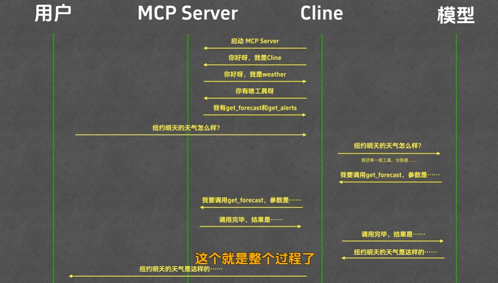

# MCP 与 Function Calling 到底什么关系（学习笔记）

> 记录日期：2026-04-25。本文基于 `E:\TsingProject\AILearning-VideoCode\MCP 与 Function Calling 到底什么关系\MarkChat` 目录做代码级分析。

## 项目内容速览

该目录是一个最小 Web Demo（`Flask + 前端页面 + 大模型 + 工具调用`），核心文件：

- `README.md`：运行方式（配置 `OPENROUTER_API_KEY`，执行 `uv run start.py`）。
- `start.py`：Flask 启动入口，暴露 `/` 和 `/chat`。
- `backend.py`：模型请求、Function Calling 处理、工具执行主逻辑。
- `mcp_server.py`：用 `FastMCP` 定义 `search` 工具并通过 `stdio` 启动。
- `mcp_client.py`：MCP 客户端，负责连接 MCP server 并调用 tool。
- `templates/index.html` + `static/script.js`：前端聊天页与工具调用信息展示。
- `pyproject.toml`：依赖包含 `flask`、`mcp`、`requests`、`dotenv`。

## 结论先说

`Function Calling` 和 `MCP` 不是二选一关系，而是不同层次：

- `Function Calling` 解决的是“模型如何表达要调用哪个工具、传什么参数”。
- `MCP` 解决的是“工具如何被标准化暴露、如何被客户端发现/调用、如何跨进程/跨服务连接”。

一句话：
- `Function Calling` 更像模型侧的“调用意图协议”；
- `MCP` 更像工具侧的“接入与通信协议”。

在工程里它们常常是互补关系：模型先通过 Function Calling 决策，然后由应用层把调用路由到 MCP 工具。

## 这个示例里两者如何出现

### 1) Function Calling 在哪里

在 `backend.py` 中：
- 定义了 OpenAI 风格 `tools`（`type=function`，函数名 `search`，含 JSON Schema 参数）。
- 首次请求模型时把 `tools` 一起传给 `/chat/completions`。
- 如果模型返回 `tool_calls`，就解析函数名和参数。
- 执行工具后，把 `role=tool` 的结果回填到对话历史，再发第二次模型请求生成最终回答。

这就是典型 Function Calling 两阶段流程：
1. 模型选工具并给参数。
2. 应用执行工具并回填结果，再让模型组织最终答案。

### 2) MCP 在哪里

在 `mcp_server.py` + `mcp_client.py` 中：
- `mcp_server.py` 用 `FastMCP` 注册 `search` 工具。
- `mcp.run(transport='stdio')` 启动 MCP server。
- `mcp_client.py` 用 `ClientSession + stdio_client` 连接该 server，并执行 `call_tool`。

这体现的是标准 MCP 调用链路：`MCP Client -> MCP Server -> Tool`。

## 当前代码状态（重点）

`backend.py` 里同时有两种工具执行路径：

- `execute_tool(...)`：本地直接返回模拟结果（当前 `process_user_query` 实际使用这条）。
- `execute_tool_with_mcp(...)`：通过 `MCPClient` 去调用 `mcp_server.py`（当前没有接进主流程）。

也就是说：
- 这个项目“展示了 MCP 能力”，
- 但默认聊天主链路仍是 Function Calling + 本地工具执行。

这是一个教学上很常见的写法：先跑通 Function Calling，再展示如何把工具执行层替换为 MCP。

## 它们的关系可以怎么理解

可以把整体拆成三层：

1. 决策层（LLM）
- 由 Function Calling 负责“决定调用什么工具 + 参数”。

2. 编排层（你的后端）
- 解析 `tool_calls`，做权限/参数校验，选择调用本地函数、HTTP API 或 MCP 工具。

3. 工具层（Tool Runtime）
- MCP 提供统一工具注册与调用协议，让工具更易复用、解耦和跨进程部署。

所以二者并不冲突，而是：
- Function Calling 偏“模型到编排层”；
- MCP 偏“编排层到工具层”。

## 什么时候用谁

只做小 Demo、工具很少、都在本进程：
- 仅 Function Calling 就够。

多工具、跨团队、跨语言、跨进程、要统一接入：
- 用 MCP 管理工具层更合适。

成熟方案通常是混合架构：
- 继续用 Function Calling 做模型决策；
- 用 MCP 承接工具执行与治理。

## 如果把本项目改成“Function Calling + MCP”一体化

最小改动思路：

1. 在 `process_user_query` 中，把 `result = self.execute_tool(...)` 改为 `self.execute_tool_with_mcp(...)`。
2. 保留现有 `tool_calls -> role=tool -> second completion` 流程不变。
3. 后续再逐步增加：
- 工具异常处理与超时；
- 工具白名单与权限控制；
- 多 MCP server 路由；
- 统一日志与可观测性。

这样改完后，模型侧还是 Function Calling，但工具执行已经走 MCP 标准协议。

## 一段记忆版总结

- `Function Calling`：让模型“会点工具”。
- `MCP`：让系统“会接工具”。
- 两者组合：模型负责“想”，MCP 负责“做”，后端负责“管”。

