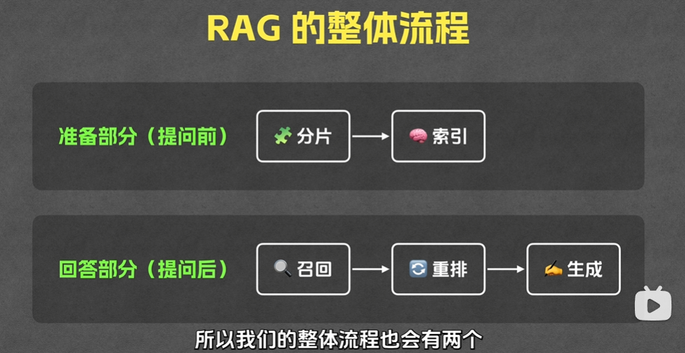

# 使用 Python 构建 RAG 系统（学习笔记）

> 记录日期：2026-04-24。本文整理 `E:\TsingProject\AILearning-VideoCode\使用Python构建RAG系统` 的项目内容，并补充 RAG 的原理笔记。

## 项目里有什么

`使用Python构建RAG系统` 目录下当前只有一个子项目：`rag/`。

`rag/` 目录的核心文件如下：
- `README.md`：运行说明。要求先安装 `uv` 和 `Jupyter`，并在 `.env` 中配置 `GEMINI_API_KEY`。
- `pyproject.toml`：依赖定义，核心依赖为 `chromadb`、`sentence-transformers`、`google-genai`、`python-dotenv`。
- `.python-version`：Python 版本为 `3.12`。
- `doc.md`：一篇示例文档，内容是“哆啦A梦与超级赛亚人：时空之战”，用于演示检索和问答。
- `main.ipynb`：项目主体，按 Notebook 形式一步步演示一个最小可运行 RAG 流程。
- `uv.lock`：依赖锁定文件。

## 这个项目做了什么

这是一个教学型、最小闭环的 RAG 示例。它不是一个完整 Web 应用，而是用 Notebook 把 RAG 的几个核心步骤拆开演示：

1. 读取文档并切分文本
- `main.ipynb` 里先读取 `doc.md`。
- 然后通过 `split("\n\n")` 按段落做最基础的 chunk 切分。

2. 把文本块转成向量
- 使用 `SentenceTransformer("shibing624/text2vec-base-chinese")`。
- 每个 chunk 经过 `encode(..., normalize_embeddings=True)` 生成 embedding。

3. 把向量存进向量数据库
- 使用 `chromadb.EphemeralClient()` 创建临时 Chroma 客户端。
- 把 `documents` 和 `embeddings` 写入 collection，形成可检索索引。

4. 根据问题做召回
- 用户问题先被编码成 query embedding。
- 再调用 Chroma 的 `query(..., n_results=top_k)` 找出最相近的若干段文本。

5. 对召回结果做重排
- 项目又加入了 `CrossEncoder('cross-encoder/mmarco-mMiniLMv2-L12-H384-v1')`。
- 它会对 “问题-片段” 配对重新打分，再挑出更相关的前几个片段。

6. 把片段交给大模型生成答案
- 使用 `google-genai` 的 `generate_content(...)`。
- Prompt 中会同时放入“用户问题”和“检索后的上下文片段”，让模型基于资料回答。

一句话概括：这个项目演示的是 `切分 -> 向量化 -> 入库 -> 检索 -> 重排 -> 生成` 的标准 RAG 管线。

## RAG 是什么

RAG 是 `Retrieval-Augmented Generation`，中文一般叫“检索增强生成”。

它的核心思想是：
- 先从外部知识库里找资料（Retrieval）；
- 再把找回来的资料连同问题一起交给大模型生成答案（Generation）。

这样做的目的，是让模型不是只靠“参数记忆”回答，而是能基于指定资料作答。

## 为什么需要 RAG

只靠大模型直接回答，常见问题有：
- 模型知识可能过时。
- 模型不知道你的私有资料。
- 模型容易“看起来很像真的，但其实是编的”。

RAG 的价值就在于：
- 让回答更贴近你的文档和知识库。
- 降低幻觉概率。
- 让模型能回答“原本不在训练语料里的私有问题”。
- 不必每次都微调模型，就能接入新知识。

## RAG 的基本原理

可以把它理解成一个“两段式系统”：

### 第一段：检索
系统先去知识库里找“和问题最相关”的内容。

典型做法：
- 先把文档切成小块（chunk）。
- 再把每个 chunk 转成向量（embedding）。
- 查询时也把问题转成向量。
- 用向量相似度找最接近的问题片段。

为什么不能整篇文档直接喂给模型？
- 文档可能太长，超过上下文窗口。
- 就算放得下，也会增加成本和噪音。
- 真正相关的内容通常只占其中一小部分。

所以，RAG 的第一步本质上是在做“信息压缩和定位”。

### 第二段：生成
检索拿回几个相关片段后，再把这些片段拼进 prompt，让大模型回答。

此时模型的角色不再是“凭记忆背答案”，而更像：
- 阅读员：先读上下文；
- 总结员：提炼关键信息；
- 回答员：把材料组织成自然语言答案。

这就是 RAG 的关键：知识来源更多来自“检索到的上下文”，而不是模型自己的记忆。

## 这个项目中的 RAG 流程图（文字版）

在本项目里，一次问答大致如下：

1. 用户提问，例如：`哆啦A梦使用的 3 个秘密道具分别是什么？`
2. 系统把问题编码成向量。
3. 去 Chroma 里找到最相似的若干段 `doc.md` 文本。
4. 使用 Cross Encoder 对这些候选片段再打一次分。
5. 选出更相关的前几段。
6. 把“问题 + 这些片段”交给 Gemini。
7. Gemini 基于这些片段生成最终答案。

所以它不是“模型直接知道答案”，而是“模型先看到检索回来的证据，再组织成答案”。

## 项目里的关键技术点

### 1. Chunking（切分）
这个项目采用的是最简单的分块策略：按空行切段落。

优点：
- 实现简单，便于教学。
- 对示例文档这种段落结构清晰的文本已经够用。

局限：
- 如果段落特别长，会出现 chunk 过大。
- 如果信息跨段分布，会被切散。
- 实际项目中常会使用“固定长度 + overlap”或“按语义切分”。

### 2. Embedding（向量化）
项目用中文向量模型把 chunk 和 query 都映射到同一个向量空间。

作用：
- 让“语义相近”的文本在向量空间里距离更近。
- 即使问题和原文不是完全同词，也能做相似匹配。

### 3. Vector Store（向量库）
项目用的是 `ChromaDB`，而且是 `EphemeralClient()`。

这意味着：
- 数据主要存在内存或临时上下文中；
- 更适合教学和实验；
- 不适合生产环境中的持久化知识库。

### 4. Retrieval（召回）
系统先做一个较宽的初筛，比如先取 `top_k=5`。

这一步追求的是：
- 尽量别漏掉相关内容；
- 哪怕多带一点候选，也先召回回来再说。

### 5. Rerank（重排）
项目额外加了 Cross Encoder，这是一个很重要的增强点。

原因是：
- embedding 检索快，但排序不一定最细致；
- cross encoder 会直接看“问题 + 候选片段”的配对关系；
- 它通常更慢，但排序更准确。

所以常见组合就是：
- 第一阶段用向量检索做粗召回；
- 第二阶段用 reranker 做精排。

### 6. Generation（生成）
最后由 Gemini 根据筛出来的上下文回答问题。

这一步的质量取决于：
- 检索回来的片段是否真的相关；
- prompt 是否清楚要求“基于给定片段回答”；
- 模型本身的理解和组织能力。

## RAG 的优点

- 比纯大模型问答更可控，因为回答有外部证据。
- 更容易接入企业私有文档、知识库、FAQ、说明书。
- 更新知识时只需要更新文档和索引，不必重新训练模型。
- 可以保留“来源片段”，便于做可追踪回答。

## RAG 的局限

- 如果检索错了，生成再强也会“基于错误上下文正确发挥”。
- chunk 切得不好，会导致信息丢失或召回不准。
- 向量模型不合适时，语义匹配效果会下降。
- top_k 太小可能漏召回，太大又会带来噪音。
- RAG 不能彻底消灭幻觉，只是显著降低。

一句话理解：`Garbage In, Garbage Out` 在 RAG 里依然成立，只不过“输入垃圾”常常来自检索阶段，而不是生成阶段。

## 适合什么场景

RAG 特别适合：
- 企业知识库问答
- 产品文档/接口文档问答
- 教学资料问答
- 论文、报告、制度文档检索问答
- 私有数据不方便拿去微调的场景

不一定适合的场景：
- 完全不依赖外部知识、纯推理型问题
- 知识量极小，直接塞进 prompt 就够用
- 对实时性要求极高，但又不能接受检索和重排延迟

## 这个示例的教学价值

这个项目的价值不在于“工程完备”，而在于它把 RAG 的主干步骤拆得很清楚，适合初学者建立整体心智模型：

- 文档从哪里来：`doc.md`
- 文本如何切块：Notebook 里的 `split_into_chunks`
- 向量如何生成：`SentenceTransformer`
- 向量放到哪里：`ChromaDB`
- 如何把相关内容找回来：`retrieve`
- 如何提高排序质量：`rerank`
- 如何基于上下文回答：`generate`

如果后续要工程化，通常会继续补：
- 持久化向量库
- 更稳的 chunk 策略
- 文档元数据与来源追踪
- 引用展示
- 多文档导入
- 检索评估与答案评估

## 一段最实用的总结

RAG 不是在“训练模型记住你的文档”，而是在“回答前先替模型查资料”。

因此，做 RAG 的关键不只是选大模型，还包括：
- 文档怎么切；
- 向量模型怎么选；
- 检索怎么做；
- 是否需要 rerank；
- prompt 怎么约束模型只基于资料回答。

当你理解了这条链路，就已经掌握了这个项目想演示的核心。

